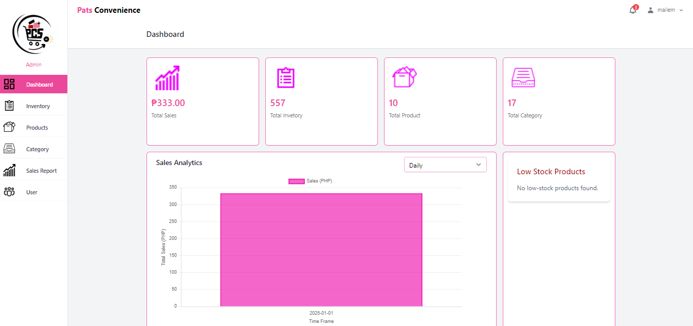
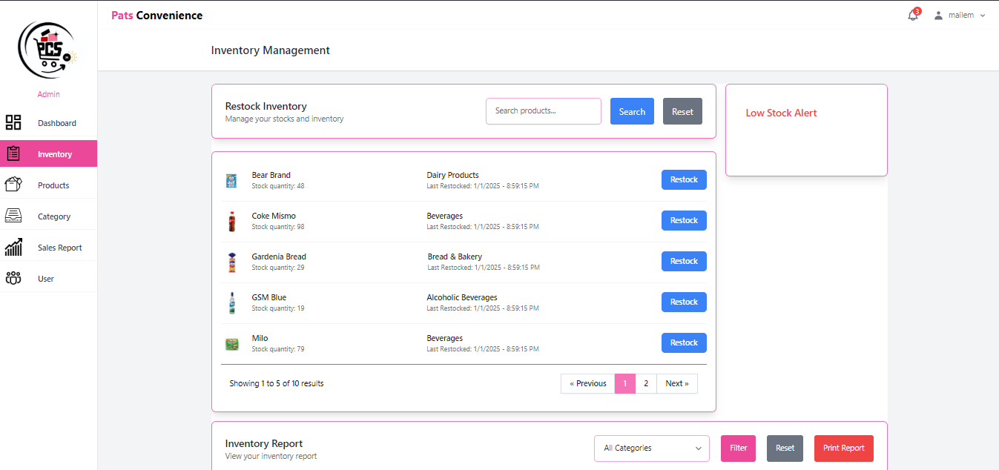
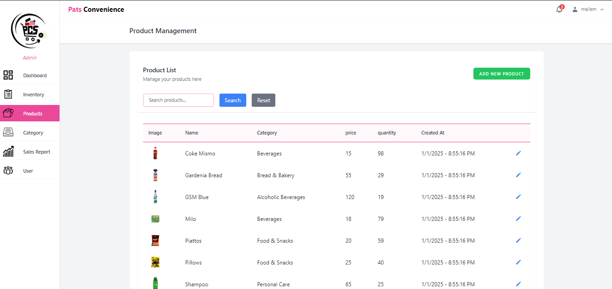
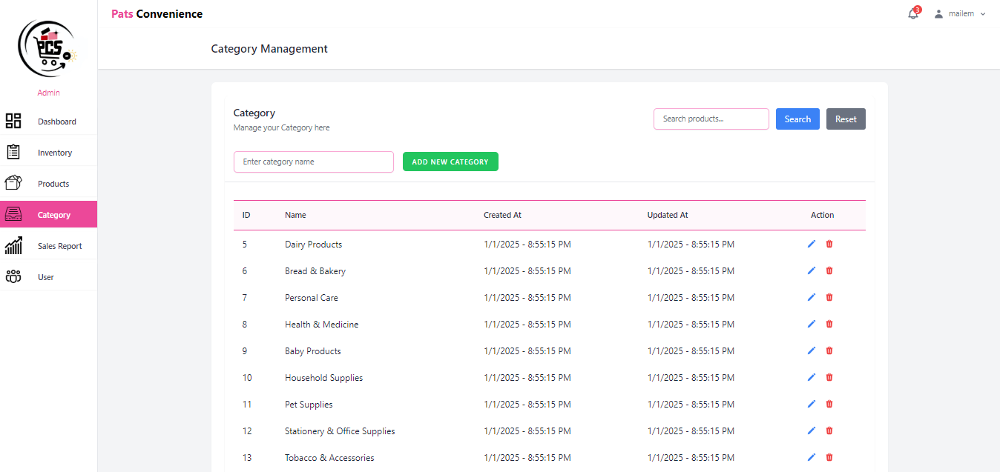
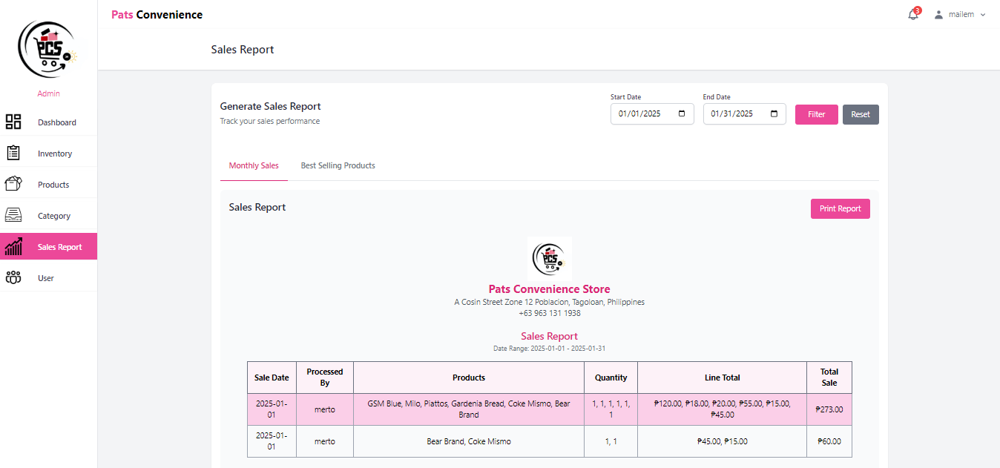
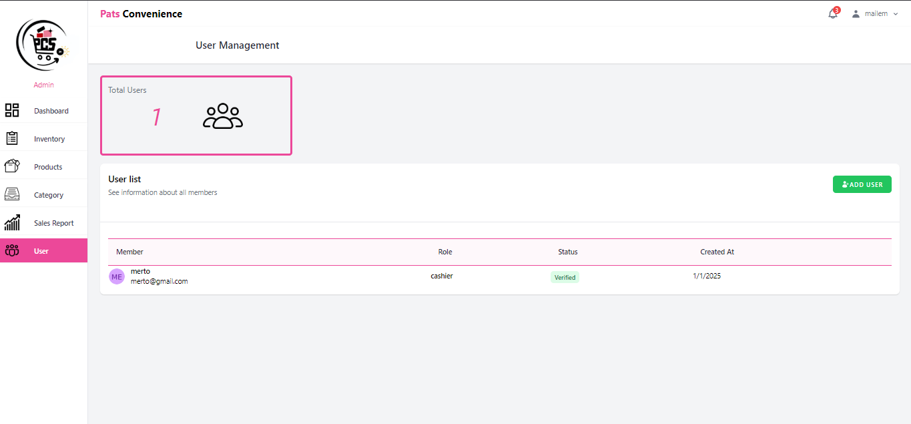
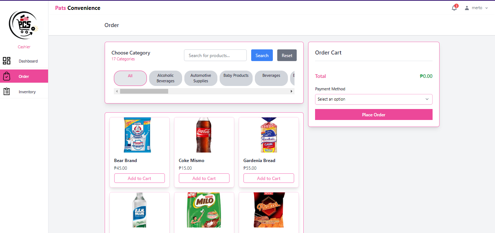

# INTEGPROG02 - Final Task Performance: Point of Sale with Inventory Management System

## Overview

This project is a Point of Sale (POS) system with inventory management for Pat's Convenience Store. The system is designed to streamline sales transactions and manage inventory efficiently.

## Features

- **Dashboard**: Overview of sales, inventory, and other key metrics.
- **Inventory Management**: Track stock levels, manage product information, and update inventory.
- **Product Management**: Add, edit, and categorize products efficiently.
- **Category Management**: Organize products into categories for better management.
- **Sales Transactions**: Process sales quickly and accurately.
- **Sales Report**: Generate detailed sales reports to analyze performance.
- **User Management**: Secure login for employees with role-based access.
- **Order Transactions**: Manage and track customer orders seamlessly.

## Installation

1. Clone the repository:

    ```bash
    git clone https://github.com/yourusername/laravel-pos.git
    ```

2. Navigate to the project directory:

    ```bash
    cd laravel-pos
    ```

3. Install dependencies:

    ```bash
    composer install
    npm install
    ```

4. Copy the `.env.example` file to `.env` and configure your environment variables:

    ```bash
    cp .env.example .env
    ```

5. Generate an application key:

    ```bash
    php artisan key:generate
    ```

6. Run the migrations:

    ```bash
    php artisan migrate
    ```

7. Seed the database:

    ```bash
    php artisan db:seed
    ```

8. Serve the application:

    ```bash
    php artisan serve
    ```

## Usage

1. Access the application in your web browser at `http://localhost:8000`.
2. Log in with the provided credentials.
3. Navigate through the dashboard to manage sales and inventory.

## Example Images

Here are some images of the application:

### Dashboard



### Inventory Management



### Product Management



### Category Management



### Sales Report



### User Management



### Order Transactions



## Contributing

1. Fork the repository.
2. Create a new branch:

    ```bash
    git checkout -b feature-branch
    ```

3. Make your changes and commit them:

    ```bash
    git commit -m "Description of changes"
    ```

4. Push to the branch:

    ```bash
    git push origin feature-branch
    ```

5. Open a pull request.

## License

This project is licensed under the MIT License. See the [LICENSE](LICENSE) file for details.

## Contact

For any inquiries, please contact Pat's Convenience Store at [email@example.com](mailto:email@example.com).
